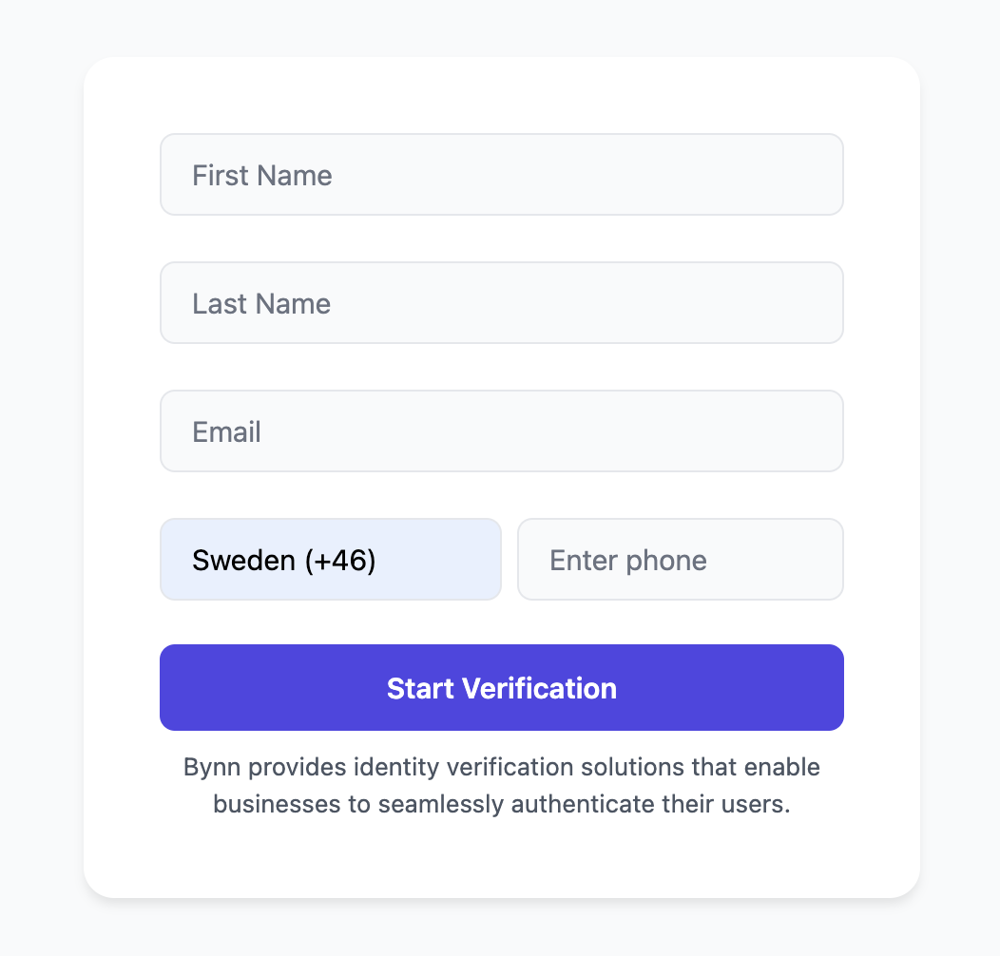
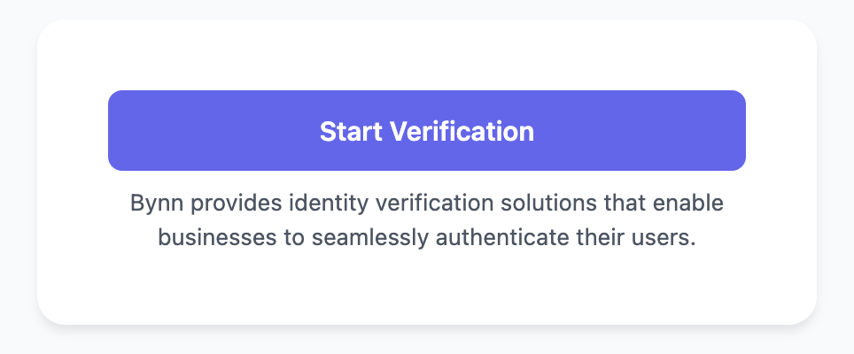

# Bynn Verification SDK

A JavaScript SDK for integrating Bynn's identity verification service into web applications.

The Bynn Web SDK enables seamless integration of advanced verification capabilities directly into your web applications. With this SDK, you can verify passports, ID cards, and other essential documents effortlessly.

To get started with this SDK, you’ll need a Bynn account. Don’t have one yet? No problem! Create your free account today at [bynn.com](https://bynn.com) and unlock access to cutting-edge verification tools.

Start verifying smarter, and trust faster with Bynn!

[Create an account and try for free](https://bynn.com)

## Installation

Include as a script tag:

```html
<script src="https://static.bynn.com/sdk/js/1.2/bynn.min.js"></script>
```
or

```html
<script type="module">
  import * as Bynn from 'https://static.bynn.com/sdk/js/1.2/bynn.esm.js';
</script>
```

or install it via a package manager

```bash
npm install @bynn-intelligence/websdk
```

## Basic Usage

```javascript
   // CommonJS
  const Bynn = require('@bynn-intelligence/websdk');

  // ES6 style import
  import { Bynn } from '@bynn-intelligence/websdk';
```

Bynn SDK requires one parent element in HTML:

```html
<div id="bynn-verify-form"></div>
```

To initialize the library, you will need to provide your API Key and parentId.
- Fields are optional, but including them enhances the verification process.
- ‘unique_id’ is highly recommended if you conduct more than a few verifications per month. It enables automatic matching of applicants in your system, streamlining the process.

Tip: The more data you send, the more comprehensive intelligence we can deliver, ensuring higher accuracy and better insights for your verifications.

```javascript

const bynn = Bynn({
  apiKey: 'your_PUBLIC_api_key',
  parentId: 'verification-form',
  fields: [
    { name: 'first_name', visible: true },
    { name: 'last_name', visible: true },
    { name: 'email_address', visible: false, value:'john@doe.com' },
    { name: 'phone_number', visible: true },
    { name: 'unique_id', visible: false, value:'550e8400-e29b-41d4-a716-446655440000' },
  ]
});

bynn.mount();
```




## Example with only button
You can pass all data hidden from the user like this

```javascript

const bynn = Bynn({
  apiKey: 'your_PUBLIC_api_key',
  parentId: 'verification-form',
  fields: [
    { name: 'first_name', visible: false, value:'John'  },
    { name: 'last_name', visible: false, value:'Doe'  },
    { name: 'email_address', visible: false, value:'john@doe.com' },
    { name: 'phone_number', visible: false, value:'+1234567890'  },
    { name: 'unique_id', visible: false, value:'550e8400-e29b-41d4-a716-446655440000' },
  ]
});

bynn.mount();
```

This will generate only the verification button.




**Pro Tip:** If you want to create your own verification button and modal we suggest using our session API instead of the web sdk. Read more about the session API at [docs.bynn.com](https://docs.bynn.com) 

## Configuration Options

### Fields Configuration

The `fields` array accepts objects with the following properties:

```javascript
{
  name: string;       // Field name (required)
  visible: boolean;   // Whether to show the field (default: true)
  value: string;      // Pre-filled value (optional)
  label: string;      // Custom label text (optional)
}
```

Available field names:
- `first_name`
- `last_name`
- `email_address`
- `phone_number`
- `unique_id`

Example with all options:
```javascript
const bynn = Bynn({
  apiKey: 'your_PUBLIC_api_key',
  parentId: 'verification-form',
  fields: [
    { 
      name: 'first_name',
      visible: true,
      label: 'Given Name',
      value: 'John'
    },
    {
      name: 'unique_id',
      visible: false,
      value: 'USER123'
    }
  ]
});
```

### Customizing Text

You can customize button and loading text:

```javascript
bynn.mount({
  submitBtnText: 'Verify Identity',
  loadingText: 'Please wait...'
});
```

### Event Handling

Handle verification session events:

```javascript
const bynn = Bynn({
  // ...other options
  onSession: (error, response) => {
    if (error) {
      console.error('Verification error:', error);
      return;
    }
    console.log('Verification started:', response);
  }
});
```

## Styling

The SDK uses CSS custom properties (variables) for styling. Override these variables to customize the appearance:

```css
:root {
  /* Primary colors */
  --bynn-primary: #6366F1;
  --bynn-primary-hover: #4F46E5;
  --bynn-primary-disabled: #C7D2FE;
  --bynn-primary-light: #EEF2FF;
  
  /* Background colors */
  --bynn-bg-white: #FFFFFF;
  --bynn-bg-input: #F9FAFB;
  
  /* Neutral colors */
  --bynn-neutral-50: #F9FAFB;
  --bynn-neutral-100: #F3F4F6;
  --bynn-neutral-200: #E5E7EB;
  --bynn-neutral-300: #D1D5DB;
  --bynn-neutral-600: #4B5563;
  --bynn-neutral-800: #1F2937;
}
```

### CSS Classes

You can also style specific elements using these CSS classes:

- `.bynn-form` - The form container
- `.bynn-input-wrapper` - Input field wrapper
- `.bynn-input` - Input fields
- `.bynn-submit` - Submit button
- `.bynn-description` - Footer text
- `.bynn-modal-overlay` - Verification modal overlay
- `.bynn-modal-container` - Modal container
- `.bynn-modal-content` - Modal content
- `.bynn-modal-close` - Modal close button

Example custom styles:

```css
.bynn-form {
  max-width: 500px;
  padding: 2rem;
}

.bynn-input {
  border-radius: 8px;
  border: 2px solid var(--bynn-neutral-200);
}

.bynn-submit {
  background: var(--bynn-primary);
  font-weight: 600;
}
```

## Internationalization

Set the language for the verification interface:

```javascript
const bynn = Bynn({
  apiKey: 'your_api_key',
  parentId: 'verification-form',
  i18n: 'en-US' // Language code
});
```

## API Reference

### Bynn Configuration

| Option | Type | Required | Description |
|--------|------|----------|-------------|
| `apiKey` | string | Yes | Your Bynn API key |
| `parentId` | string | Yes | ID of container element |
| `fields` | Field[] | No | Form field configuration |
| `i18n` | string | No | Language code |
| `onSession` | function | No | Session callback |

### Field Configuration

| Option | Type | Required | Description |
|--------|------|----------|-------------|
| `name` | string | Yes | Field identifier |
| `visible` | boolean | No | Show/hide field |
| `value` | string | No | Default value |
| `label` | string | No | Custom label |

## Browser Support

The SDK supports all modern browsers:
- Chrome/Edge (latest)
- Firefox (latest)
- Safari (latest)
